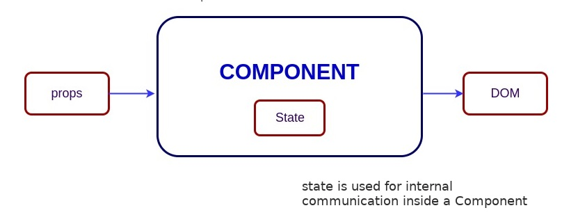

# Stateless Components From Stateful Components

## 컴포넌트 복습


#### 컴포넌트

UI 의 일부분을 묘사하는 독립적인 엔티티. 각각 특정한 기능을 담당한다.

하나의 컴포넌트는 더 작은 컴포넌트들로 쪼개질 수 있다. 컴포넌트 간의 **종속관계** 형성.

페이스북은 3만개 이상의 컴포넌트들로 구성되어있다!

ex) 검색 바, 뉴스피드 등 (볼 수 있는 모든 것이 컴포넌트로 이루어져있다!)



#### state

- 컴포넌트에서 관리하는 상태 값 (내부에서 선언)
- `this.setState()` 메서드를 이용해 변경이 가능하다. (비동기 동작)

- constructor 메서드를 이용해 선언

```jsx
constructor(props){
  super(props);
  this.state = { ... }
}
```

#### props

- 컴포넌트에서 사용되는 데이터 (외부에서 받는 값)
- **해당 컴포넌트 내에서 변경 불가능!!!!!**
- 부모 컴포넌트에서 자식 컴포넌트로 데이터를 전달할 때 사용
- Render를 이용해서만 `props`를 건네줄 수 있다!

```jsx
render() {
  this.props.lastname = 'Legend'; 			// 이런식으로 변경하면 안된다!!!!!!
  return <h1>Hi there, {this.props.firstName}</h1>; 
}

<Hello firstName='John' lastname='Doe'/>
```

> 즉, props 와 state 는 모두 dynamic information 이지만, 
>
> - props는 다른 컴포넌트에서 수정 가능한 것
> - state는 해당 컴포넌트에서 수정 가능한 것 
>   - 다른 컴포넌트에서 수정하기 위해서는
>     1. setState가 담긴 메서드를 props로 쏴주고
>     2. 다른 컴포넌트에서 이를 시행한다
>     3. 아래서 코드와 함께 언급!


## Stateless? Stateful?

#### **stateless component**

- state를 가지지 않는 컴포넌트
- constructor 메서드가 없다!

```jsx
class Child extends React.Component{
  render(){
    return <h1>Hey, my name is {this.props.name}</h1>  ///전달받은 props
  }
}
```


#### **stateful componenet**

- 한개 이상의 state 를 가지는 컴포넌트
- constructor 메서드가 필요하다! (initial state 를 지정하기 위해서)
- 당연한 얘기지만, **클래스 컴포넌트**만 state를 포함할 수 있다. <br/>(클래스 컴포넌트를 사용하는 주된 이유)

```jsx
class Parent extends React.Component{
  constructor(props){
    super(props);
    this.state = { name: 'Frarthur'}  //state 설정
  }
  render(){
    return <Child name="Frarthur" />  //props 를 전달
  }
}
```


## Child Component 에서 Parent Component 의 state 를 바꾸어보자! 

1. setState가 담긴 메서드를 props로 쏴주고
2. 다른 컴포넌트에서 이를 시행한다.
3. 그러면 원래 컴포넌트의 state 가 바뀐다!

```jsx
class ParentClass extends React.Component {
  constructor(props) {
    super(props);
    this.state = { totalClicks: 0 };    //Parent 의 state 정함
    this.handleClick = this.handleClick.bind(this);  
    //handleClick 메서드를 다른 메서드(render)에서 사용하기 위함
  }
  handleClick() {
    const total = this.state.totalClicks;
    this.setState(
      { totalClicks: total + 1 }
    );
  }
  render() {
    return (
      <ChildClass Click={this.handleClick} />  
      //handleClick 메서드를 Click 이라는 이름으로 ChildClass의 props로 전달
    );
  }
}

class ChildClass extends React.Component {
  render() {
    return (
      <button onClick={this.props.Click}>  
      //앞의 onClick은 버튼이 눌렸을 때 실행하겠다는 의미
      //뒤의 Click은 전달받은 Click이라는 props (ParentClass의 handleClick)를 실행
      //따라서 버튼을 누르면 ParentClass의 state가 바뀐다!
        Click Me!
      </button>
    );
  }
}
```


다른 예제!

```jsx
import React from 'react';
import ReactDOM from 'react-dom';

class Parent extends React.Component {
  constructor(props) {
    super(props);
    this.state = { name: 'Frarthur' }; 
    this.changeName = this.changeName.bind(this);
  }
  
  changeName(newName) {
    this.setState({
      name: newName
    });
  }

  render() {
    return <Child name={this.state.name} onChange={this.changeName} />
  }
}


class Child extends React.Component {
  constructor(props) {
    super(props);
    
    this.handleChange = this.handleChange.bind(this);
  }

  handleChange(e) {  	//여기서 e 는 자바스크립트의 Event 인터페이스
    									//e 는 이번 Event 를 의미하는듯?	
    const name = e.target.value;
    this.props.onChange(name);
  }

  render() {
    return (
      <div>
        <h1>
          Hey my name is {this.props.name}!
        </h1>
        <select id="great-names" onChange={this.handleChange}>
          <option value="Frarthur">Frarthur</option>
          <option value="Gromulus">Gromulus</option>
        </select>
      </div>
    );
  }
}

ReactDOM.render(
	<Parent />,
	document.getElementById('app')
);
```


##  Child Components Update Sibling Components

#### Parent 컴포넌트 

```jsx
class Parent extends React.Component {
  constructor(props) {
    super(props);
    this.state = { name: 'default' };
    this.changeName = this.changeName.bind(this);  
    //render 에서 changeName 메서드를 사용하기 위함
  }

  changeName(newName) {
    this.setState({
      name: newName
    });
  }

  render() {
    return (
      <div>
        <Child Change={this.changeName} /> 		//changeName 이라는 메서드를 전달
        <Sibling name={this.state.name} />  	//name이라는 값을 전달
      </div>
    );
  }
}

ReactDOM.render(
  <Parent />,
  document.getElementById('app')
);
```

#### Child 컴포넌트 (입력 받아서 Parent의 state 변경)

```jsx
class Child extends React.Component {
  constructor(props) {
    super(props);
    this.handleChange = this.handleChange.bind(this);
  }

  handleChange(e) {  	//여기서 e 는 자바스크립트의 Event 인터페이스
    									//e 는 이번 Event 를 의미하는듯?	
    const name = e.target.value;  //이번 Event의 Value 를 name 변수에 저장
    this.props.Change(name);  
    //Change 라는 이름으로 전달받은 props (Parent 에서 changeName메서드) 실행
    //setState를 실행하면서 Parent의 state 가 바뀐다!
    
    // **의문점**  변화가 발생했을 때 Parent 의 state가 바뀌는 것은 알겠는데,
		// 웹페이지에 표시되는 내용(Sibling에서 담당)이 바뀌려면 새로 render되어야 하지 않나?
    // 이후에 render 가 다시 일어나나??? 새로고침 없이 값이 바뀌는데, 어떤 원리이지? 
    // Ajax 같은건가..? 
    // 맞구나! 새로고침 없이 값만 다시 render
    // setState 자체가 다시 렌더하는 것을 포함
  }

  render() {
    return (
      <div>
        <select id="great-names" 
        onChange={this.handleChange}>    
          //여기서의 onChange는 변화가 발생하면 handleChange 메서드를 실행한다는 뜻
          <option value="Changyeon">Changyeon</option>
          <option value="Hyemin">Hyemin</option>
          <option value="Jungwoo">Jungwoo</option>
          <option value="Minji">Minji</option>
          <option value="Sangwon">Sangwon</option>
        </select>
      </div>
    );
  }
}
```

#### Sibling 컴포넌트 (Parent의 state를 props로 받아서 출력)

```jsx
class Sibling extends React.Component {
  render() {
		const name = this.props.name;  //props 로 전달받은 값을 name 변수에 저장
    return (
      <div>
        <h1>Sibling name: {name}</h1>  //변수 출력!
      </div>
    );
  }
}
```


## 기타

#### Stateless Component 는 왜 사용하는가?

Stateless Component 를 사용하면 컴포넌트를 간결하게 작성할 수 있으며, 개별 상태가 없으므로 이해하기 쉽고 예측이 용이하여 테스트를 간단히 할 수 있다. 또한 라이프사이클을 사용하지 않으므로 불필요한 검사 및 메모리 할당을 줄일 수 있다. React의 바람직한 사례는 Stateless Component를 많이 사용하고 Stateful Component는 적게 사용하는것이다.


## 이건 그냥 재미로 읽어보면 좋을 것 같아서!

[React 적용 가이드 - 네이버D2](https://d2.naver.com/helloworld/1848131)

[React.js 와 Vue.js 비교 1](https://joshua1988.github.io/web_dev/vue-or-react/)

[React.js 와 Vue.js 비교 2 (번역이 별로지만...)](https://medium.com/@erwinousy/%EB%82%9C-react%EC%99%80-vue%EC%97%90%EC%84%9C-%EC%99%84%EC%A0%84%ED%9E%88-%EA%B0%99%EC%9D%80-%EC%95%B1%EC%9D%84-%EB%A7%8C%EB%93%A4%EC%97%88%EB%8B%A4-%EC%9D%B4%EA%B2%83%EC%9D%80-%EA%B7%B8-%EC%B0%A8%EC%9D%B4%EC%A0%90%EC%9D%B4%EB%8B%A4-5cffcbfe287f)


## 참고

https://code.tutsplus.com/ko/tutorials/stateful-vs-stateless-functional-components-in-react--cms-29541

[react 에서의 바인딩 방법들](https://medium.com/@khwsc1/react%EC%97%90%EC%84%9C%EC%9D%98-%EB%B0%94%EC%9D%B8%EB%94%A9-binding-%EB%B0%A9%EB%B2%95%EB%93%A4-a595ff9190b6)

[리액트 - 이벤트 처리하기](https://ko.reactjs.org/docs/handling-events.html)

